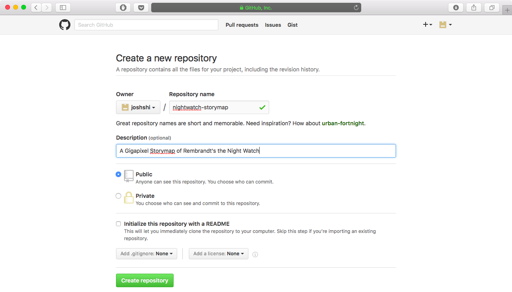
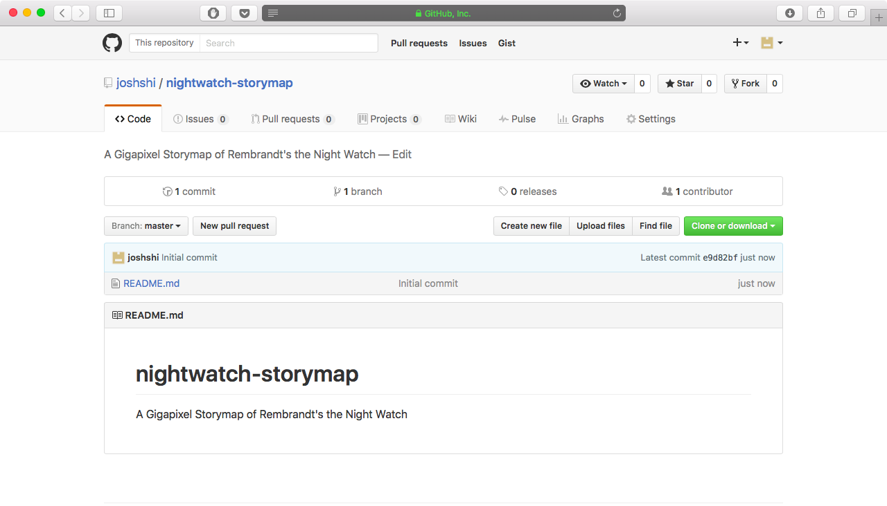
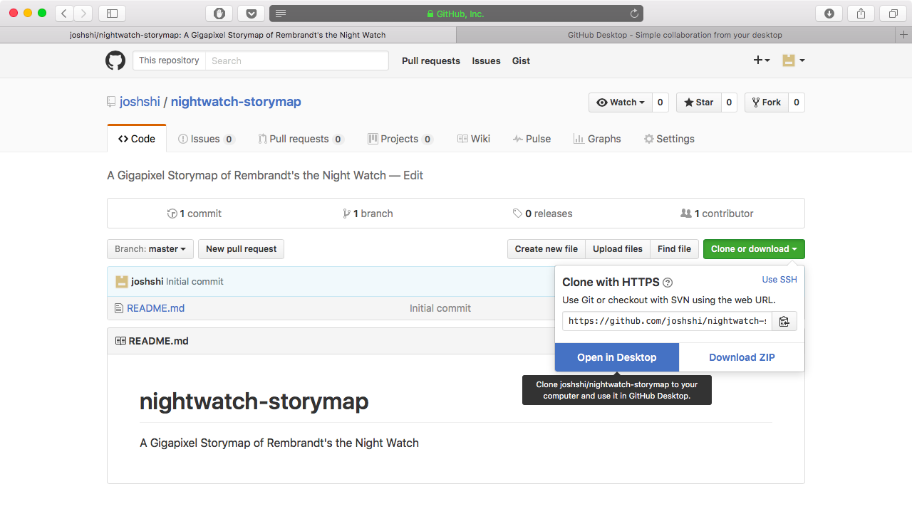
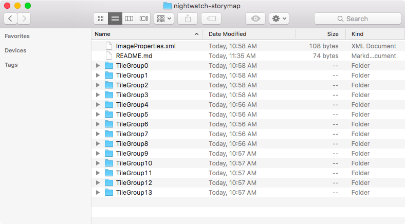
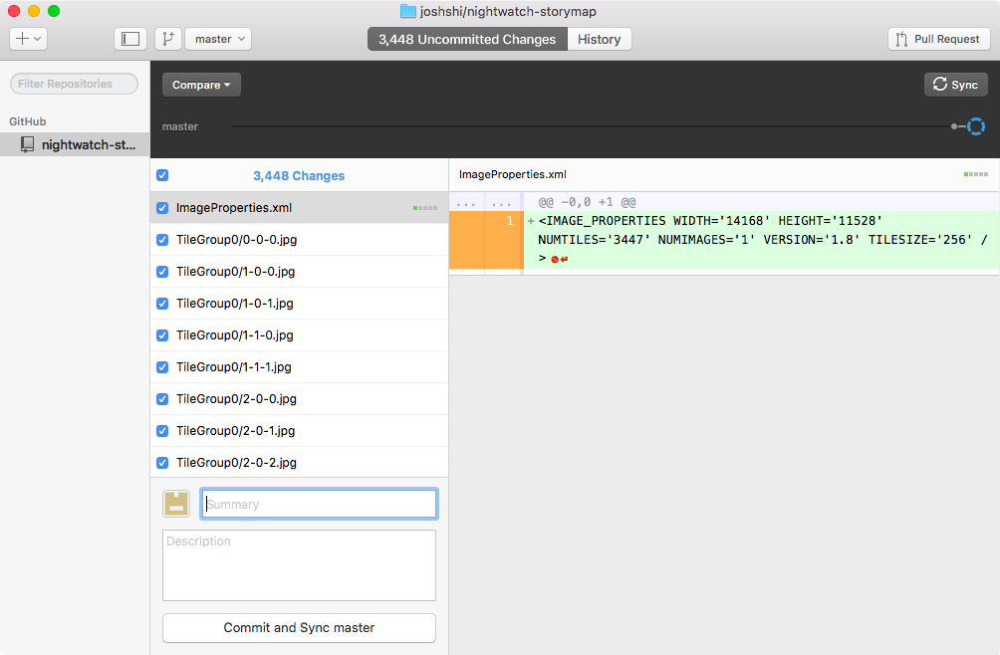
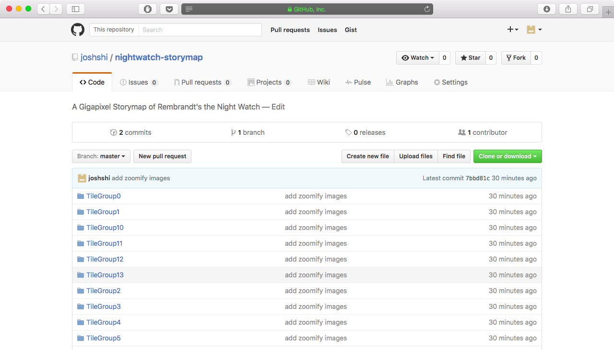
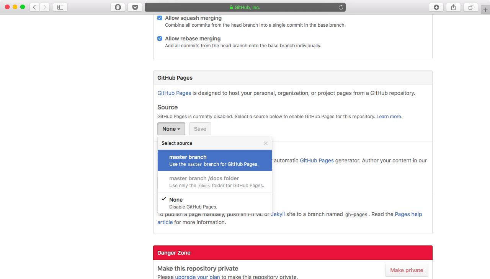
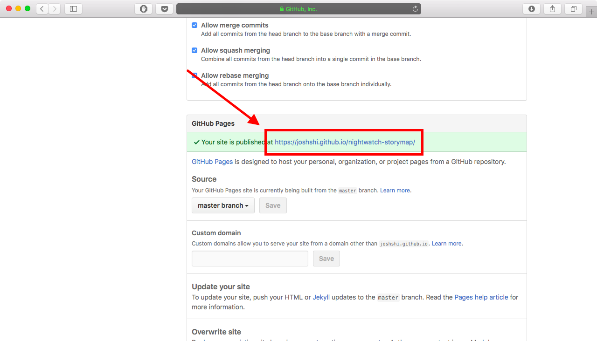

# Hosting your Gigapixel through Github

Before you can being this process, you wil need to have generated Zoomify images. You can learn more about how to make one (here)[https://storymap.knightlab.com/gigapixel/].

1. Sign up to create an account on Github. A free account is fine. 
2. Start a new project either by pressing the “Start a project” button or, if you already have a Github account, clicking on the plus sign in the top right and selecting “New repository.”

3. Create your new repository, and give it an identifying name. Make sure your repository is set to public. Initialize your repository with a README.

4. If you’re new to Github, download Github Desktop (https://desktop.github.com). Then go to the “Clone or download” button and click “Open in Desktop.” If you're comfortable using Github through the command line, you can clone the repository like normal, move your Zoomify images to your cloned folder, push, and skip to step 7.

5. Once you have your project repository cloned, you can right-click the repository name and select “Open in Finder.” This is the folder on your computer where you will place your Zoomify images, and it should already have one file in it: the README we created in step 3. Once you’ve located the folder on your computer, move all the files and folders generated by Zoomify into your repository folder.

6. Go back to the Github Desktop application. You should now have a tab at the top of your screen that says “X Uncommitted Changes.” In the “Summary” field, type a descriptive message of your content. Click “Commit and Sync master” to upload your files (Note: the button may be disabled for a while after clicking “Commit and Sync master” if your image is somewhat large. This is normal).

 
7. Once your sync has completed, navigate to the settings tab and scroll down to the “Github Pages” section. Create a page for your project by selecting the source branch (master) and clicking “Save.” Scroll back down to the Github Pages section and you will find the url you can use to create your Gigapixel (Note: clicking on this link directly will take you to an error page saying that Github can’t find what you’re looking for. This is normal.).

You're done! Use the [Storymap authoring tool](https://storymap.knightlab.com/select/) to create your Gigapixel and include your Github url.
